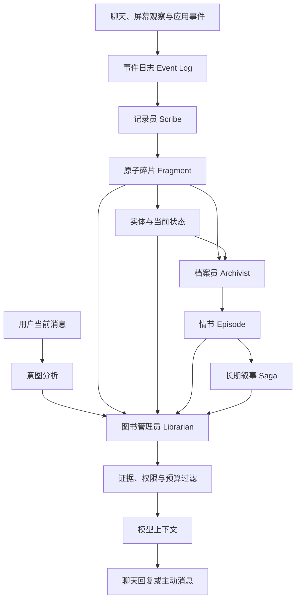

# Cyrene Memory v2 完整设计

> 状态：已实现并通过验收
> 首次设计：2026-07-13
> 实现更新：2026-07-14
> 适用分支：`liyi-Cyrene`
> 目标：将现有 L0/L1/L2 记忆升级为面向长期陪伴关系的、可追溯、可整理、可遗忘的全局记忆系统。

## 1. 摘要

Memory v2 将记忆视为“Cyrene 与用户共同生活形成的连续关系”，而不是某个聊天窗口的附属数据。

不同会话只负责整理话题和保存各自的短期上下文。核心画像、当前状态、记忆碎片、人物与项目、共同经历和长期叙事均为全局共享。主会话只承担主动消息默认投递位置，不拥有额外的记忆权限。

系统采用三段式后台流水线：

1. **记录员（Scribe）**：从聊天、屏幕观察和其他可信事件中提取原子记忆。
2. **档案员（Archivist）**：整理实体、状态、情节和长期叙事，处理重复、冲突与生命周期。
3. **图书管理员（Librarian）**：根据当前问题进行全文、向量、实体和时间联合检索，并控制记忆的引用方式。

设计参考 [MemoryConstellations](https://github.com/ClaraShafiq/MemoryConstellations)，但不直接移植其服务结构、ChromaDB 部署或星图界面。Cyrene 保留现有证据链、冲突解析、记忆审计、软删除和 RAG 同步能力，并逐步迁移到 SQLite。

## 2. 设计目标

### 2.1 核心目标

- Cyrene 能跨会话自然地记住用户、共同经历和持续中的事情。
- 记忆必须能追溯到原始消息或事件，减少模型将推测写成事实。
- 临时状态、长期事实和共同经历有不同的更新与遗忘方式。
- 召回结果同时考虑语义、关键词、实体、时间、重要性和可信度。
- 系统可以在空闲时整理记忆，不阻塞聊天，也不过度调用模型。
- 用户可以查看、纠正、固定、合并和遗忘记忆。
- 旧版 `memory.json`、会话文件与 RAG 数据能够无损迁移和回滚。
- 记忆可以为主动消息提供依据，但不得因此制造虚假经历或频繁打扰。

### 2.2 非目标

- 不为不同聊天会话建立长期记忆权限隔离。
- 不在第一阶段实现装饰性星座图或复杂 3D 可视化。
- 不要求额外运行 ChromaDB、PostgreSQL 或远程记忆服务。
- 不让情绪分数、长期叙事或模型推测覆盖用户刚刚表达的事实。
- 不把所有聊天内容都提取为长期记忆。
- 不用记忆系统替代原始聊天记录、任务系统或知识库文档。

## 3. 设计原则

### 3.1 一位 Cyrene，一套全局记忆

- 所有会话共享长期记忆。
- 会话 ID 只用于来源追溯、短期上下文和界面定位。
- 当前会话的近期内容可以获得召回加权，但不能阻止其他会话记忆被读取。
- 主会话是主动消息默认目的地，不是“超级权限会话”。

### 3.2 原始记录与派生记忆分离

- 原始消息是证据，不等同于记忆。
- Claim 是一个事实命题的稳定身份；Fragment 是证据化表达，State 与 Relation 是该命题的时间和图结构投影。
- Fragment、State、Relation、Episode、Saga 都是可重建的派生数据，不得彼此冒充独立权威来源。
- 每次合并、修正和提升都保留来源链。
- 删除派生索引不应破坏原始聊天；删除原始聊天时必须明确提示对证据链的影响。

### 3.3 明确事实优先于推断

可信度从高到低：

1. 用户明确陈述或明确纠正。
2. 多次一致表达且有多条证据。
3. 单次但语义清晰的表达。
4. Cyrene 根据上下文作出的推断。
5. Cyrene 自己生成的描述。

只有第 1 类可以自动更新核心画像。第 4、5 类不得直接写入稳定事实。

### 3.4 当前信息优先，历史信息可追溯

- 用户的新纠正不会物理覆盖旧记忆，而是建立 `supersedes` 关系。
- 召回默认返回当前有效版本。
- 用户询问“以前”或“变化”时，允许读取历史版本。
- 模型需要知道一条记忆是当前事实、历史事实还是仅供联想。

### 3.5 宁可少记、少召回，也不确信地编造

- 弱相关结果不注入上下文。
- 证据不足的内容只允许作为联想，不允许当作事实直接说出。
- 每轮注入有严格 token 预算和层级配额。

## 4. 现有系统评估

### 4.1 可直接保留

- L0 明确事实写入限制与固定能力。
- L1 近期目标、偏好和项目状态。
- L2 的证据、来源消息、访问次数、状态和 RAG ID。
- MemoryJudge 的保守提取提示词与过度概括检查。
- 冲突候选、冲突评分、Resolver 队列和修订链。
- 压缩结果先同步 RAG、成功后归档来源的事务顺序。
- Memory Audit 对缺失证据、错误链接和可疑绝对化表达的检查。
- 分支删除后保留一段时间、随后逐渐遗忘的行为。
- 后台 LLM 串行队列，避免与主聊天争抢请求和触发限流。

### 4.2 需要替换或增强

- `memory.json` 数组会随使用时间持续增长，不适合作为长期唯一事实源。
- L2 同时承担事实、事件、总结和长期经历，语义过于混杂。
- 每个会话固定 6 轮触发一次提取，可能漏掉短会话，也可能重复处理长会话。
- 实体图主要依赖文本规则，实体别名、合并和关系证据不足。
- 当前召回偏向向量相似度，缺少完整的全文、实体与意图融合。
- L1 是固定字符串字段，不适合多个并行项目和带有效期的状态。
- 压缩主要按条目相似度工作，缺少围绕实体和事件的叙事整理。

## 5. 总体架构



### 5.1 运行边界

- 所有核心逻辑运行在 Electron 主进程。
- Renderer 只通过 IPC 读取视图模型和提交用户操作。
- SQLite 是结构化记忆的唯一事实源。
- 向量索引是可删除、可重建的派生索引。
- 权威 SQLite 写入和对应的 Outbox 任务必须在同一事务提交；RAG 写入不得发生在该事务提交之前。
- RAG 返回的内容只作为候选 ID，Librarian 必须重新读取 SQLite 并校验状态、revision 和 content hash。
- LLM 处理必须进入现有后台队列，失败不能影响主聊天。

## 6. 记忆层级

### 6.0 Claim：跨层事实身份

Claim 表示“这几条不同形态的数据是否在谈同一个事实命题”，本身不保存新的用户经历。一个 Claim 可以同时拥有 Fragment、Current State 和 Entity Relation 投影，但召回时只占一个候选位置。

- Fragment 提供事实正文、来源和修订依据，是派生投影的主要证据。
- Current State 仅回答该 Claim 目前是否成立，并受 `expires_at` 和证据 revision 约束。
- Entity Relation 仅提供图结构导航，并受 `valid_until` 和证据 revision 约束。
- 同一 Claim 的多层命中会折叠为一个候选，其他投影只补充时效、结构和证据强度。
- Claim 不替代 Source；没有可追溯 Source 的 Claim 不能自动成为稳定事实。

### 6.1 Working Context：工作上下文

用途：维持当前会话的连续对话。

- 当前会话最近若干条消息。
- 当前尚未结束的模型请求、工具调用和流式回复。
- 当前会话滚动摘要。
- 不作为长期记忆直接使用。
- 会话切换不会丢失，回复始终写回最初发起请求的会话。

建议预算：总上下文的 35% 至 50%。

### 6.2 Core Profile：核心画像

用途：长期稳定、几乎每轮都需要知道的用户事实与交互边界。

Core Profile 采用**固定字段 + 受控扩展事实**的混合结构。

固定字段：

- 用户希望被如何称呼。
- 职业或长期身份。
- 长期兴趣。
- 常用语言。
- 明确的长期偏好和禁忌。
- 用户手动固定的永久说明。

固定字段具有稳定的类型、提示词和设置界面，适合每轮都可能使用的核心信息。新增固定字段需要 schema migration，但不会出现同义键重复或模型随意创造字段的问题。

受控扩展事实保存无法自然归入固定字段、但又足够稳定且由用户明确确认的信息，例如重要纪念日、长期生活条件或固定设备环境。扩展事实使用 `namespace + key + value`，其中 `namespace` 和 `key` 必须来自应用登记的类型；未知 key 进入待确认区，不能由模型直接创建后立即生效。

写入规则：

- 只接受用户明确陈述、手动编辑或明确纠正。
- 自动更新必须保留旧版本与证据。
- 固定字段不会被后台流程覆盖。
- 扩展事实不得与固定字段或已有扩展事实形成同义重复。
- 高频使用且结构稳定的扩展事实可以在后续 schema 版本中晋升为固定字段。
- 核心画像不参与自动遗忘。

### 6.3 Current State：当前状态

用途：表达“现在正在发生什么”，替代单字符串 L1。

示例：

- 正在开发 Cyrene-Agent Memory v2。
- 最近在优化 NovelAI 绘图。
- 本周准备完成某个任务。
- 当前希望 QQ 只用于聊天。

字段包含状态类型、内容、开始时间、有效期、状态和证据。状态支持：

- `active`：当前有效。
- `resolved`：事情已完成或已解决。
- `expired`：超过有效期。
- `superseded`：被新状态替代。

默认有效期由类型决定，最长自动有效期 90 天。用户固定后可长期保留。

### 6.4 Fragment：原子记忆碎片

用途：保存最小、可验证的记忆单位。

要求：

- 一条只表达一个事实或观察。
- 通常不超过 80 个汉字。
- 以第三人称或中性陈述保存，不保留角色口癖。
- 至少关联一条证据。
- 区分用户事实、共同经历、偏好、计划、关系和观察。

示例：

```text
用户希望 QQ 只用于日常聊天，不再从 QQ 下达任务。
用户正在设计 Cyrene 的第二版记忆系统。
Cyrene 与用户共同完成了 NovelAI 绘图工作台的多阶段改造。
```

### 6.5 Entity：实体

用途：将分散记忆围绕稳定对象组织起来。

实体类型：

- `person`
- `place`
- `project`
- `interest`
- `application`
- `event`
- `organization`
- `concept`

每个实体具有标准名、别名、简述、状态和合并关系。实体关系必须有证据，例如：

```text
用户 --develops--> Cyrene-Agent
Cyrene-Agent --integrates--> NapCat
用户 --interested_in--> NovelAI
```

实体识别优先使用已知别名和规则；只有无法判断的新实体才调用 LLM。

### 6.6 Episode：情节

用途：把同一件事相关的多个 Fragment 合成一段可读经历。

- 长度建议 100 至 300 个汉字。
- 围绕一个事件、项目阶段或关系变化。
- 保留参与实体、时间范围和全部来源碎片。
- 不得添加来源中不存在的动机、评价或结果。
- Episode 质量高于单个 Fragment，长期回顾时优先召回。

### 6.7 Saga：长期叙事

用途：表达跨越多次事件的长期脉络。

示例：

- Cyrene-Agent 从单机聊天工具逐步发展为桌面陪伴 Agent。
- 用户对 Cyrene 绘画能力的长期改造过程。

规则：

- 至少由 3 个不同 Episode 支持。
- 仅在深度归档时生成。
- 作为长期回顾和主动消息的弱信号。
- 不直接作为精确事实引用。
- 不进入每轮固定上下文。

## 7. 数据模型

### 7.1 存储策略

- 新数据库：`userData/cyrene-memory/memory-v2.sqlite`
- SQLite 开启 WAL、外键和 busy timeout。
- 所有权威 SQLite 写入使用事务，并在同一事务写入索引 Outbox 任务。
- 数据库 schema 使用独立版本号和顺序迁移脚本。
- 嵌入向量继续使用现有 RAG 索引作为过渡，后续评估 `sqlite-vec`。
- 不在首版引入需要独立进程的向量数据库。

### 7.2 核心表

#### `memory_claims`

保存跨层事实命题的稳定 ID、规范文本、语义键、类型、revision、状态和替代链。Claim 用于跨层折叠与失效传播，不作为脱离证据的第四份事实正文。

#### `core_profile`

保存称呼、职业、长期兴趣、语言和永久说明等稳定固定字段。字段具备明确类型，并沿用现有 L0 的固定、修订和证据规则。

#### `core_facts`

保存受控扩展事实，主要字段包括 `namespace`、`key`、`value`、`value_type`、`status`、`pinned` 和 `confidence`。`namespace + key` 在当前有效版本中唯一；未知类型必须经用户确认后才能生效。

#### `memory_sources`

保存可追溯的原始依据。

| 字段 | 含义 |
|---|---|
| `id` | 来源 ID |
| `source_type` | chat、screen、tool、manual |
| `conversation_id` | 来源会话，仅用于追溯 |
| `message_id` | 来源消息 |
| `occurred_at` | 事件时间 |
| `quote` | 最小必要原文片段 |
| `context_before` | 可选前文 |
| `context_after` | 可选后文 |
| `status` | active、archived、deleted |

#### `conversation_archives`

保存删除分支在 30 天保留期结束后的压缩归档。归档包含会话时间范围、参与者、话题摘要、消息数量、压缩正文、被记忆引用的证据片段清单、原会话校验哈希和归档版本。压缩正文使用应用可直接读取的本地压缩格式，不进入普通聊天列表和向量索引；证据追溯时按需解压。

归档成功必须满足“写入临时文件或事务记录、校验可解压和哈希一致、提交归档、最后移除原会话正文”的顺序。任何一步失败都保留原会话数据并进入修复队列。

#### `memory_fragments`

| 字段 | 含义 |
|---|---|
| `id` | Fragment ID |
| `claim_id` | 所属跨层 Claim |
| `content` | 原子事实 |
| `revision` | 内容修订版本，用于派生投影和向量校验 |
| `kind` | fact、preference、plan、experience、relationship、observation |
| `certainty` | explicit、inferred、uncertain |
| `attribution` | user、assistant、mixed、system |
| `confidence` | 0 至 1 |
| `importance` | 0 至 1 |
| `emotional_weight` | 0 至 1，仅作弱信号 |
| `status` | active、cooling、frozen、superseded、tombstone |
| `created_at` | 创建时间 |
| `last_accessed_at` | 最近召回时间 |
| `access_count` | 召回次数 |
| `pinned` | 是否固定 |
| `superseded_by` | 新版本 ID |

#### `memory_fragment_sources`

Fragment 与来源的多对多关系，包含证据角色和引用范围。

#### `memory_entities`

保存实体标准名、类型、别名、概览、状态与合并目标。

#### `memory_fragment_entities`

Fragment 与实体的多对多关系，包含关系角色和置信度。

#### `memory_relations`

实体之间的有向关系，包含 `claim_id`、关系类型、有效期、置信度和来源。

#### `memory_states`

保存 `claim_id`、当前状态、类型、开始时间、过期时间、解决时间和替代链。

#### `memory_state_fragments` 与 `memory_relation_fragments`

显式保存 State/Relation 依据的 Fragment ID、Fragment revision 和证据角色。仅共享 Source 或在 JSON 中记录 Fragment ID 不构成有效依赖。

#### `memory_episodes`

保存情节正文、标题、时间范围、置信度、成熟度和生命周期状态。

#### `memory_episode_fragments`

Episode 与 Fragment 的多对多关系，保留合并依据。

#### `memory_sagas`

保存长期叙事、主题、时间范围和当前版本。

#### `memory_saga_episodes`

Saga 与 Episode 的多对多关系。

#### `memory_revisions`

记录用户编辑、自动修正、合并和冲突解决前后的数据。

#### `memory_jobs`

后台任务队列，支持幂等键、重试次数、下次执行时间和错误信息。

#### `memory_vector_index`

SQLite 中的向量同步台账。记录稳定 `index_key`、目标类型、目标 ID、revision、content hash、RAG ID、同步状态与错误。它描述派生索引状态，不改变 SQLite 事实权威性。

#### `memory_recall_log`

记录查询、命中、最终注入、引用权限和得分构成，用于调试和质量评估。

### 7.3 全文与向量索引

- Fragment、Entity、Episode 建立 SQLite FTS5 索引。
- Fragment 与 Episode 建立向量索引。
- Core Profile 和 Current State 数据量小，直接结构化检索。
- Saga 默认不参与普通向量召回，只在长期回顾意图下启用。
- 索引条目必须带结构化 ID，不通过正文模糊匹配反查数据库记录。
- 稳定键格式为 `memory-v2:<layer>:<id>`；重试必须执行幂等 upsert，不能追加随机重复条目。
- 向量元数据至少包含 `indexKey`、`memoryV2Id`、layer、target revision、content hash 和 index version。
- 同步顺序为“SQLite 事实 + Outbox 事务提交 → 后台读取已提交版本 → RAG 幂等 upsert → SQLite 标记 synced”。
- 若进程在 RAG 成功后、SQLite 标记前退出，重试覆盖同一 `indexKey`；不得生成第二条向量。
- 对账同时执行 SQLite → RAG 缺失/陈旧修复和 RAG → SQLite 孤儿/重复清理。
- Librarian 对每个向量候选重新读取 SQLite；记录不存在、不可召回、revision/hash 不一致时拒绝候选并排队修复。

## 8. 记录员 Scribe

### 8.1 触发方式

不再只依赖“每个会话固定 6 轮”。采用组合触发：

- 当前累计至少 6 个未处理有效对话轮次。
- 用户停止输入 10 分钟且存在未处理消息。
- 未处理消息达到 30 条时强制排队。
- 应用退出前只持久化检查点，不强制调用 LLM。
- 应用下次启动后继续处理未完成批次。

### 8.2 输入范围

- 按消息游标读取所有会话新增内容。
- 不将会话边界当作长期记忆边界。
- 单次批次按时间邻近和话题连续性切块。
- 用户消息是主要事实来源；助手回复主要用于理解上下文。
- 屏幕观察只在用户授权且观察功能启用时参与提取。

### 8.3 输出约束

Scribe 输出严格 JSON：

```json
{
  "fragments": [
    {
      "content": "用户希望 QQ 只用于聊天。",
      "kind": "preference",
      "certainty": "explicit",
      "attribution": "user",
      "confidence": 0.98,
      "importance": 0.75,
      "sourceMessageIds": ["message-id"],
      "entities": ["QQ"]
    }
  ],
  "states": [],
  "coreProfileCandidates": []
}
```

写入前进行本地校验：

- 来源消息必须存在。
- 引用原文必须能在来源附近找到。
- 禁止没有证据的绝对词。
- 禁止将助手自述归因给用户。
- 禁止将单次情绪直接提升为长期性格。
- 与已有 Fragment 高度重复时增加证据，而不是创建副本。

## 9. 档案员 Archivist

### 9.1 轻量周期

每 5 分钟或应用空闲时执行，不调用 LLM：

- 处理别名和已知实体匹配。
- 合并完全重复的 Fragment。
- 更新访问时间和生命周期。
- 使过期 Current State 失效。
- 修复待同步向量索引。
- 执行低风险冲突规则。
- 清理已完成任务和过期缓存。

### 9.2 深度周期

满足以下条件时排队：

- 用户空闲至少 30 分钟。
- 距离上次深度整理至少 12 小时。
- 存在足够数量的新 Fragment。
- 当前没有聊天请求、绘图任务或其他高优先级 LLM 请求。

深度周期可以：

- 识别和合并新实体。
- 将 Fragment 合并为 Episode。
- 更新实体概览。
- 检测偏好演变和事实冲突。
- 将多个 Episode 整理为 Saga。
- 生成低优先级反思候选。

所有结果先写临时版本，通过验证后在一个事务中发布。

### 9.3 成本控制

- Scribe 使用便宜、稳定、支持结构化输出的模型。
- Episode 合并可使用中等能力模型。
- Saga 与复杂冲突解析才使用较强模型。
- 每日后台模型调用有次数和 token 上限。
- 用户正在聊天时，后台任务自动让出队列。

## 10. 图书管理员 Librarian

### 10.1 查询意图

先用本地规则识别，必要时才调用小模型：

- `fact`：精确事实，例如时间、名称、地址、设置。
- `current_state`：当前项目、最近计划、正在发生的事。
- `entity`：询问某个人、项目、地点或应用。
- `recent`：最近聊过或做过什么。
- `long_term`：长期变化、共同经历、回顾。
- `emotional`：关系和感受相关的回忆。
- `semantic`：普通语义召回。

### 10.2 候选来源

- Core Profile：结构化直接命中。
- Current State：状态和实体过滤。
- FTS5：精确名称、数字、关键词。
- 向量：语义近似的 Fragment 和 Episode。
- Entity：命中实体后聚合相关状态和记忆。
- Recent：当前会话短期内容与近期全局事件。
- Saga：只在长期回顾或主动消息策划时启用。

### 10.3 排名

先使用 RRF 融合不同检索通道，再进行质量重排。建议初始公式：

```text
base = RRF(fts_rank, vector_rank, entity_rank, state_rank)

quality =
  0.30 * confidence +
  0.25 * evidence_strength +
  0.20 * importance +
  0.15 * recency +
  0.10 * current_topic_affinity

final = base * quality * lifecycle_factor * intent_factor
```

约束：

- 当前有效状态优先于历史 Fragment。
- Episode 在总结和长期回顾中加权，在精确事实问题中降权。
- 当前会话近期内容可以小幅加权，建议不超过 15%。
- 固定记忆不会因时间衰减，但仍需满足相关性。
- 低于质量阈值的结果直接丢弃。
- 不使用“被召回次数越多就越可信”的规则，访问次数只用于防止热门记忆污染所有查询。

### 10.4 引用权限

每条最终结果附带权限：

- **可引用**：明确事实、证据充足、当前有效。
- **谨慎引用**：单一证据、较旧或部分推断；回复应使用“我记得好像”等表达。
- **仅供联想**：低置信度、长期叙事或弱相关结果；不能直接声称为事实。
- **禁止注入**：已删除、被替代、证据缺失或涉及敏感信息且当前无必要。

### 10.5 注入预算

默认每轮最多：

- Core Profile：4 至 8 条短字段。
- Current State：最多 4 条。
- Fragment：最多 5 条。
- Episode：最多 2 条。
- Saga：最多 1 条，且仅在匹配意图时。
- 总记忆注入不超过模型上下文预算的 15%。

注入文本必须标记类型、时间和引用权限，不向模型暴露内部评分公式。

## 11. 会话与记忆规则

### 11.1 会话用途

- 分支会话只是不同话题的聊天窗口。
- 每个会话保留自己的短期消息、滚动摘要和进行中的请求。
- 长期记忆没有会话隔离，所有会话都可以召回。
- 来源 `conversation_id` 仅用于“这条记忆从哪里来”的追溯。

### 11.2 主会话

- 始终存在，可以清空但不能删除。
- 主动消息默认发送到主会话。
- 主会话不拥有额外记忆读取权限。
- 用户可以把任意会话设为当前打开窗口，但不会改变主动消息目标。

### 11.3 清空与删除

- 清空会话只隐藏界面中的历史消息。
- 原始消息、证据和已提取记忆继续保留。
- 删除分支后，窗口立即消失，原始会话进入 30 天保留期。
- 30 天后不直接销毁原始聊天，而是压缩为带时间范围、参与者、话题和消息定位信息的归档；已提取的全局记忆按自身生命周期继续存在。
- 压缩归档优先保留被 Fragment、Episode、Revision 引用的证据片段，其余正文进入压缩存档，不再进入普通聊天加载和向量索引。
- 相关证据标记为 `source_archived`；需要追溯时按需读取归档，记忆置信度不得因归档而自动提高。

## 12. 生命周期与遗忘

### 12.1 Fragment 生命周期

建议默认值：

| 阶段 | 条件 | 行为 |
|---|---|---|
| active | 新建或近期访问 | 正常参与检索 |
| cooling | 30 天未访问 | 降低普通召回权重 |
| frozen | 90 天未访问 | 从向量索引移除，仅精确或实体检索可恢复 |
| tombstone | 365 天未访问且低重要性 | 清除正文，仅保留审计信息 |

以下情况延长生命周期：

- 用户手动固定。
- 有多个独立证据。
- 被 Episode 使用。
- 与活跃 Current State 或实体直接相关。
- 用户主动回忆或再次确认。

### 12.2 Current State 生命周期

- 到期后进入 `expired`，不作为当前事实注入。
- 新状态可替代旧状态。
- 完成状态保留为 Fragment 或 Episode 的证据。
- 计划长期未更新时先降为不确定，不直接宣称用户仍在执行。

### 12.3 Episode 与 Saga 生命周期

- Episode 默认长期保存，6 个月后进入 mature，12 个月无访问后进入 archived。
- archived Episode 只在长期回顾时检索。
- Saga 长期保存，但每次更新创建新版本。
- 任何层级都支持用户手动遗忘。

### 12.4 遗忘不等于立即删除

遗忘包括：降低召回概率、停止向量检索、归档正文和最终清除。这样既符合陪伴记忆逐渐淡化的感觉，也避免数据库无限增长。

## 13. 冲突、纠错与版本

### 13.1 冲突类型

- 无关：文本相似但描述不同事情。
- 情境差异：不同场景下偏好不同。
- 偏好演变：过去喜欢，现在不喜欢。
- 直接冲突：同一事实出现互斥版本。
- 不确定：证据不足，需要等待或询问用户。

### 13.2 处理顺序

1. 本地规则筛选冲突候选。
2. 使用证据、时间和归因计算优先级。
3. 低风险冲突自动建立版本关系。
4. 高影响且无法判断时，在合适的对话中自然询问用户。
5. 用户纠正始终优先，并形成不可丢失的 revision。

跨层裁决顺序为：用户最新明确纠正 > 有来源且仍有效的 Current State > 明确 Fragment > Relation 投影 > Episode > Saga 或推断。这个顺序只决定冲突裁决；历史查询仍可读取已替代版本。

Fragment 内容修改时 revision 必须增加，依赖旧 revision 的 State/Relation 立即失效或进入重建队列。Fragment 被 superseded 或 tombstone 时，移除该证据支持；如果仍有其他有效 Fragment 支持同一 Claim，投影继续有效，否则 State 变为 expired/superseded、Relation 变为 deleted/superseded。`cooling` 与 `frozen` 只是召回生命周期，不表示事实为假，不触发语义失效。

### 13.3 禁止行为

- 不物理覆盖旧事实后假装它从未存在。
- 不因向量相似就判定冲突。
- 不把 Cyrene 的回复当成用户事实证据。
- 不在主动消息中突然追问低价值冲突。

## 14. 主动消息集成

主动消息策划器可以读取：

- 活跃 Current State。
- 即将到期或需要跟进的计划。
- 最近 Episode。
- 高重要性但一段时间未提及的实体。
- 当前陪伴状态、用户空闲时长和打扰限制。

生成前必须判断：

- 当前是否处于允许主动消息的时段。
- 距离用户最后活动是否达到阈值。
- 是否已有未读主动消息。
- 记忆是否具有足够证据和合适的引用权限。
- 内容是否自然，而不是复述内部数据库字段。

主动消息写入主会话，并作为普通聊天事件进入后续 Scribe 流程。Cyrene 自己发出的主动消息不能单独证明用户事实。

## 15. 屏幕观察集成

- 截图本身不是长期记忆。
- 视觉模型先输出简短结构化观察。
- 只有与用户请求、当前项目或明确持续状态相关的内容才可成为 Fragment。
- 来源类型标记为 `screen`，可信度低于用户明确陈述。
- 屏幕观察形成的长期记忆默认进入待确认区；用户确认后才进入正常召回，未确认内容只能用于当前任务的短期上下文。
- 截图在观察和必要的记忆提取完成后删除。
- 不保存密码、Token、聊天隐私或其他明显敏感内容。
- 用户暂停屏幕观察后，不再产生新的 screen 来源。

## 16. 记忆管理界面

第一版使用实用的信息管理界面，不做星图。

### 16.1 页面结构

- **概览**：核心画像、活跃状态、记忆数量、同步健康。
- **人物与事物**：按实体浏览相关状态、碎片和情节。
- **时间线**：按时间查看共同经历。
- **待确认**：冲突、低置信度候选、需要用户确认的状态。
- **归档与遗忘**：冷却、冻结、已替代和已删除记录。
- **系统状态**：后台队列、索引状态、最近错误和数据库大小。

### 16.2 记忆详情

每条记忆显示：

- 当前正文和类型。
- 创建、更新和最近访问时间。
- 置信度、重要性和生命周期。
- 相关实体、Episode 和 Saga。
- 来源消息和前后文。
- 修订历史和冲突链。

可执行操作：固定、编辑、纠正、合并、标记过期、遗忘、打开来源会话。

第一版只允许直接编辑 Fragment、Core Profile 和 Current State。Episode 与 Saga 是可重建的派生叙事，不允许直接改写正文；用户发现错误时应修正其来源 Fragment，然后由 Archivist 重新生成受影响的 Episode 与 Saga。这样可以避免高层摘要与证据链长期分叉。

### 16.3 可视化后续

实体关系成熟后，可增加可选的“记忆星图”视图。星图只是浏览方式，不参与存储和召回逻辑。

## 17. 隐私与安全

- 数据默认全部保存在本机。
- API Key 和密钥继续使用 Electron `safeStorage`，不得进入记忆正文或日志。
- Scribe 输入在发送模型前过滤密钥、Authorization 头、Cookie 和常见凭据格式。
- 屏幕观察来源执行更严格的敏感文本过滤。
- 导出记忆时默认不包含原始聊天全文和密钥配置。
- 用户可以一键暂停：记忆提取、深度整理、主动消息和屏幕观察。
- 数据库损坏时保留最近可用备份，不自动用空库覆盖。

## 18. 可观测性与审计

必须提供以下指标：

- 待处理消息数量。
- 最近一次 Scribe、轻量 Archivist 和深度 Archivist 时间。
- 每种层级的记录数量和数据库大小。
- RAG 待同步、同步失败和孤立索引数量。
- 每次召回各通道命中数、淘汰原因和最终注入条目。
- 后台模型调用次数、token 用量、失败率和平均耗时。
- 无证据记忆、断裂来源、循环合并和过期状态数量。

日志默认只记录 ID 和短预览，不完整打印敏感记忆正文。

## 19. 迁移方案

### 19.1 迁移映射

| 旧数据 | v2 目标 |
|---|---|
| L0 | Core Profile 及 revision |
| L1 recentGoals | Current State: goal |
| L1 recentPreferences | Current State 或 Fragment: preference |
| L1 currentProject | Entity: project + Current State |
| 普通 L2 | Fragment |
| `isSummary` L2 | Episode 候选 |
| evidence | memory_sources + fragment_sources |
| conflictLogs | revision/conflict 记录 |
| entity-graph.json | Entity 候选和别名候选 |
| RAG user_memory | 重建索引，不作为结构化事实源 |

### 19.2 迁移阶段

1. **只读盘点**：审计旧数据，生成迁移报告和备份。
2. **创建 v2 数据库**：导入 L0/L1、L2、证据、冲突和实体候选。
3. **校验**：数量、来源链接、状态、固定项和文本哈希一致。
4. **双写**：旧系统继续服务，新写入同时进入 v2，记录差异。
5. **影子召回**：v2 只计算不注入，对比旧召回质量和延迟。
6. **小流量切换**：先启用 v2 读取，保留旧版写入和快速回滚。
7. **正式切换**：v2 成为事实源，旧文件进入只读备份。
8. **清理**：稳定两个版本周期后停止旧版双写。

迁移期间不得自动删除旧 `memory.json`、实体图或 RAG 文件。

### 19.3 回滚

- 配置项 `memory.engine = legacy | v2-shadow | v2`。
- 每次 schema migration 前自动备份 SQLite 和旧数据。
- v2 故障时可立即切回 legacy 读取。
- 双写失败时以旧系统成功为主，并将 v2 写入加入修复队列。

## 20. 开发阶段

### 阶段 0：规格与基线

- 固化数据模型、迁移规则和评分初值。
- 为现有记忆创建回归数据集。
- 记录旧系统召回质量、延迟和内存占用。

验收：设计评审通过，测试样本覆盖事实、纠正、跨会话、长期回顾和噪音查询。

### 阶段 1：SQLite 与迁移骨架

- 建库、migration、repository、事务和备份。
- 迁移 Core、State、Fragment、Source。
- 开启双写但仍由旧系统读取。

验收：迁移数量一致；重复运行幂等；失败可回滚；旧功能无回归。

### 阶段 2：Scribe v2

- 全局消息游标和空闲触发。
- 原子提取、本地校验、去重和证据链。
- Core 和 State 严格写入规则。

验收：不把助手内容错写给用户；不漏掉短会话；重复提取不产生副本。

### 阶段 3：Librarian v2

- FTS5、向量、实体和状态检索。
- 查询意图、RRF、质量重排和引用权限。
- 影子召回评测后切换读取。

验收：精确事实优于模糊相似项；跨会话召回正常；无关查询允许返回空。

### 阶段 4：Archivist v2

- 实体别名、关系和重复合并。
- Episode 生成与来源验证。
- Current State 到期和 Fragment 生命周期。

验收：Episode 不增加无证据事实；后台任务不阻塞聊天；失败可重试。

### 阶段 5：冲突、长期叙事与主动消息

- 将现有 Resolver 迁移到 revision 模型。
- Saga 生成和版本管理。
- 主动消息使用状态、情节和引用权限。

验收：用户纠正立即生效；历史仍可追溯；主动消息不暴露内部字段。

### 阶段 6：管理界面与正式切换

- 实体、时间线、来源、纠正、固定和遗忘界面。
- 系统状态、数据库维护和导入导出。
- 停止 legacy 双写并保留只读备份。

验收：用户能解释“Cyrene 为什么记得这件事”，并能完整修正或删除它。

## 21. 测试策略

### 21.1 单元测试

- schema migration 和事务回滚。
- Fragment 校验、去重和归因。
- 状态到期、替代和恢复。
- 实体别名、合并与关系证据。
- RRF、衰减、权限和预算。
- 冲突分类和 revision 链。
- 生命周期边界和固定记忆。

### 21.2 集成测试

- 多会话内容写入同一全局记忆库。
- 当前会话短期上下文保持独立。
- 分支删除后长期记忆仍可召回。
- 原始来源清理后证据状态正确变化。
- SQLite 与 RAG 同步失败后自动修复。
- SQLite 事务回滚时 Fragment、向量台账和 Outbox 任务全部不存在。
- 在“RAG 成功、SQLite 未标记”故障点重启后，幂等重试不产生重复向量。
- 对账能识别并修复缺失、陈旧、重复和孤立向量。
- 向量候选必须通过 SQLite status、revision 和 content hash 二次验证。
- 同一 Claim 的 State、Fragment 和 Relation 命中只占一个召回候选。
- Fragment 修改、替代或遗忘会按多证据规则失效其派生 State/Relation。
- 应用重启后后台任务游标不重复、不丢失。

### 21.3 召回评测

建立至少 100 条匿名测试问题，标注：

- 必须召回的记忆。
- 可以召回的辅助记忆。
- 不应召回的干扰项。
- 期望引用权限。

指标：Recall@5、Precision@5、MRR、无关注入率、过期事实引用率、平均注入 token 和 P95 延迟。

### 21.4 人格体验测试

- 回复是否自然使用记忆，而不是朗读数据库。
- 是否区分“确定记得”“模糊印象”和“只是联想到”。
- 是否避免频繁重复同一段共同经历。
- 主动消息是否与当前状态相关且不过度打扰。

## 22. 性能目标

- 普通记忆检索 P95 小于 150 ms，不含远程 embedding 请求。
- 已缓存查询 P95 小于 50 ms。
- 每轮最终注入不超过预设 token 预算。
- 后台轻量周期单次小于 100 ms。
- 深度整理不占用聊天模型队列的高优先级位置。
- 数据库和索引损坏不会导致聊天主流程白屏或退出。

## 23. 默认配置建议

这些生命周期数值作为内部默认策略随版本维护，不在普通设置或高级设置中开放，避免用户无意间破坏记忆生命周期的一致性。需要调整时通过数据库迁移和版本化配置完成。

```json
{
  "memory": {
    "engine": "v2-shadow",
    "scribe": {
      "idleMinutes": 10,
      "maxBacklogMessages": 30,
      "minPendingTurns": 6
    },
    "archivist": {
      "lightIntervalMinutes": 5,
      "deepIdleMinutes": 30,
      "deepMinIntervalHours": 12
    },
    "retrieval": {
      "maxFragments": 5,
      "maxEpisodes": 2,
      "maxSagas": 1,
      "maxContextRatio": 0.15,
      "currentConversationBoost": 0.1
    },
    "lifecycle": {
      "fragmentCoolingDays": 30,
      "fragmentFrozenDays": 90,
      "fragmentTombstoneDays": 365,
      "deletedConversationRetentionDays": 30
    }
  }
}
```

## 24. 已确定决策

- 长期记忆全局共享，不做会话隔离。
- 会话只隔离短期上下文和界面状态。
- 主会话只负责主动消息默认投递。
- Core Profile 使用固定字段与受控 `core_facts` 相结合的混合结构。
- 自动遗忘天数不向用户开放设置。
- 分支删除 30 天后将原始聊天压缩归档，不直接彻底删除。
- 屏幕观察产生的长期记忆默认进入待确认区。
- 第一版只直接编辑 Core、State 和 Fragment；Episode 与 Saga 根据来源重新生成。
- SQLite 是 v2 结构化事实源。
- 现有 RAG 作为过渡向量索引，可重建而非权威数据源。
- 保留证据链、冲突解析、审计、固定和渐进遗忘。
- 先完成可靠的数据与检索能力，再考虑星图可视化。
- 升级必须支持双写、影子读取和快速回滚。

## 25. 实现状态总览

截至 2026-07-14，Memory v2 的数据层、后台流水线、召回、迁移、管理界面和可观测性已经接入 Cyrene 主进程。本节不是新的设想，而是对当前代码实现的说明。前文描述架构目标，本节说明这些目标具体由哪些模块、表和事务实现。

| 目标 | 状态 | 主要实现 |
| --- | --- | --- |
| SQLite 权威存储与迁移 | 已实现 | `database.ts`、`schema.ts` |
| 全局 Scribe 事件队列 | 已实现 | `scribe-queue.ts`、`scribe-writer.ts`、`bridge.ts` |
| Claim 与跨层证据一致性 | 已实现 | `claim-graph.ts` |
| 冲突、修订与显式纠正 | 已实现 | `conflict-resolver.ts`、`scribe-writer.ts` |
| 多通道 Librarian 召回 | 已实现 | `librarian.ts` |
| RAG Outbox、幂等写入与对账 | 已实现 | `vector-sync.ts`、`src/main/rag/*` |
| Fragment/State/Episode/Saga 生命周期 | 已实现 | `archivist.ts`、`deep-archivist.ts`、`saga-archivist.ts` |
| Entity 关联、概览和合并 | 已实现 | `entity-linker.ts`、`entity-merge.ts` |
| Fragment 手动合并 | 已实现 | `fragment-merge.ts` |
| 会话压缩归档 | 已实现 | `conversation-archive.ts`、`chats-store.ts` |
| 旧版双写、影子召回和修复 | 已实现 | `legacy-migrator.ts`、`legacy-repair.ts`、`shadow-recall.ts` |
| 待确认记忆 | 已实现 | `pending-memory.ts` |
| 导入、导出与备份 | 已实现 | `memory-portability.ts`、`database.ts` |
| 记忆中心与一键暂停 | 已实现 | `memory-center.ts`、设置页、IPC/preload |
| 后台模型预算与指标 | 已实现 | `background-metrics.ts` |

当前数据库 schema 版本为 `4`。新安装直接建立完整 schema；旧数据库按 `schema_migrations` 与 `PRAGMA user_version` 逐级升级。文件数据库启用外键、WAL、`busy_timeout=5000` 和 `synchronous=NORMAL`，升级前会 checkpoint 并复制 SQLite、WAL、SHM 到备份目录。

## 26. 权威数据与一致性实现

### 26.1 SQLite 是唯一事实源

代码中的权威边界如下：

1. `memory_sources` 保存原始证据及可选前后文。
2. `memory_claims` 保存语义命题的稳定身份。
3. Fragment、State、Relation、Episode、Saga 是由证据和 Claim 派生出的不同视图。
4. `memory_revisions` 保存用户或系统对这些对象执行的创建、修正、替代、失效、合并和恢复记录。
5. `memory_vector_index` 与外部 RAG 数据仅是派生索引，不参与事务权威判断。

因此，“SQLite 与 RAG 双存储一致性”不是两份事实相互投票。SQLite 决定对象是否存在、是否有效、当前 revision 和正文哈希；RAG 只提供候选 ID。RAG 可以被整库删除并从 SQLite 重建，不会丢失结构化记忆。

### 26.2 Claim、Fragment、State、Relation 的关系

同一语义事实允许同时出现在三个投影中：

- Fragment 表达“证据化的原子记忆”。
- State 表达“当前仍成立且可能过期的状态”。
- Relation 表达“实体之间的图关系”。

这不会形成三条互相竞争的权威事实，因为三者通过 `claim_id` 指向同一个 Claim。Librarian 召回后按 Claim 折叠，同一 Claim 即使通过多层命中也只占一个上下文槽位。不同查询意图仍可选择更合适的投影，例如“最近在做什么”优先 State，“以前发生过什么”优先 Episode。

### 26.3 Fragment 修改后如何让派生数据过期

State 和 Relation 不通过文本相似度猜测自己是否过期，而是使用显式版本依赖：

- `memory_state_fragments` 保存 `state_id + fragment_id + fragment_revision + evidence_role`。
- `memory_relation_fragments` 保存 `relation_id + fragment_id + fragment_revision + evidence_role`。
- 建立派生投影时，`linkStateToFragment()` 与 `linkRelationToFragment()` 把当时的 Fragment revision 写入依赖表。

当 Fragment 被修改、替代、合并或遗忘时：

1. Fragment 的 `revision` 增加，或状态变为 `superseded` / `tombstone`。
2. 写路径调用 `invalidateFragmentProjections()` 做即时检查。
3. 对每个依赖 State/Relation，系统查询是否仍存在状态为 `active/cooling/frozen` 且 revision 完全匹配的 `support` Fragment。
4. 如果还有其他有效支持证据，派生对象继续有效。
5. 如果已无有效支持，State 变为 `superseded` 或 `expired`；Relation 变为 `superseded` 或 `deleted`。
6. 每次状态变化都写入 `memory_revisions`，记录原因和前后值。
7. 如果该 Claim 已无任何当前 Fragment 支持，Claim 才会变为 `retired`。

轻量 Archivist 每 5 分钟调用 `reconcileProjectionValidity()` 再做一次全库兜底。它可以发现进程崩溃、旧代码写入或人工数据库修改造成的 revision 不一致。因此系统采用“写路径即时失效 + 周期对账修复”，而不是依赖单一回调。

State 自己的 `expires_at` 与 Relation 的 `valid_until` 是另一条独立的时间失效路径。即使证据仍有效，时间窗结束后它们也会进入历史状态。用户可在记忆中心恢复历史 State；恢复会清除过期时间、设为 `active` 并固定，同时写入 `restore` 修订。

### 26.4 修改、替代、合并与删除的区别

- **修改**：保留对象 ID，增加 revision；旧依赖因 revision 不匹配而失效，当前对象重新排队建立向量。
- **替代**：旧对象状态设为 `superseded`，`superseded_by` 指向新对象，旧派生投影按多证据规则检查。
- **合并**：目标对象保留；来源、实体、Episode、State/Relation 依赖和 Claim 关联迁移到目标，再把被合并对象标为 `superseded`。
- **遗忘**：Fragment 变为 `tombstone`，正文替换为占位符，只保留 SHA-256、原长度和审计记录；不再被其他有效记忆引用的来源正文会被清空并标记为 `deleted`。

Entity 合并限制为同类型，检测 `merged_into` 链以阻止环。合并时迁移别名、Fragment 关联和 Relation 端点，并清理自关系及重复关系。Archivist 只自动合并规范化后完全相同的实体名称；其他情况由用户在记忆中心选择，避免模糊实体被误合并。

## 27. 后台流水线的代码实现

### 27.1 Scribe

每个完成的用户/助手回合由 `appendScribeTurn()` 事务写入：

- 两条 `memory_sources`，分别保存用户和助手原文；
- 一条 `memory_event_log`，保存待处理游标和 source ID。

事件队列是全局的，不按会话隔离长期记忆；`conversation_id` 只用于来源追溯和当前会话加权。启动时 `resetInterruptedScribeEvents()` 将异常退出留下的 `processing` 事件恢复为可重试状态。

后台模型产生候选后，`writeMemoryCandidatesV2()` 在一个 SQLite 事务中执行本地约束：

- 空内容、敏感凭据和无来源候选拒绝写入。
- Core 只接受明确的用户证据。
- State、Fragment 需要通过字段、长度、置信度和证据校验。
- 语义相同的 Fragment 合并证据，不重复建立事实。
- 明确的用户纠正可以 supersede 相反的旧 Fragment。
- 每次创建、修改和拒绝原因都有可测试的确定性分支。

Scribe 成功后再将事件标记为 `processed`；失败记录错误和尝试次数，可安全重试。已处理事件的完整 payload 保留 30 天后清空，失败 payload 保留 90 天；Source、修订和会话归档不随这项派生日志清理而删除。

### 27.2 轻量 Archivist

`MemoryV2ArchivistScheduler` 每 5 分钟运行一次，且同一时间只允许一个 cycle。轻量周期依次执行：

1. 影子模式遗留快照修复。
2. 遗留实体图导入。
3. 已知实体链接、完全重复实体合并、系统实体概览刷新。
4. Claim 回填、Fragment 精确去重和生命周期推进。
5. State/Relation 证据 revision 对账及时间过期。
6. Episode 成熟/归档和派生日志清理。
7. 每 6 小时执行一次向量台账对账。
8. 处理 RAG Outbox 作业。

Fragment 默认生命周期为 30 天冷却、90 天冻结、365 天低重要性遗忘。被固定或具有多来源、Episode、Entity、活动 State 等耐久信号的 Fragment 使用 4 倍生命周期且不会按普通低重要性规则直接墓碑化。被冻结的 Fragment 被有效召回后可恢复活动并重建向量。

Episode 在 180 天后进入 `mature`，长期未访问且达到 365 天后进入 `archived`。归档不是删除；历史意图仍允许读取成熟和归档 Episode。

### 27.3 深度 Archivist

深度整理只在以下条件同时满足时运行：

- 没有活动中的 AG-UI 任务；
- LLM 队列空闲；
- 最近会话活动已空闲 30 分钟；
- 距上次成功至少 12 小时；
- 每日最多 2 次。

`deep-archivist.ts` 先确定允许使用的 Fragment 候选集合，再让后台模型生成 Episode 草稿。`validateEpisodeDraft()` 要求输出内容、时间和引用全部落在允许集合内，`publishEpisodeDraft()` 才在事务中写入 Episode、Fragment/Source 链和修订。`saga-archivist.ts` 对至少 3 个相关 Episode 采用同样的“候选白名单 -> 模型草稿 -> 本地验证 -> 发布”过程。

深度任务失败会写 `deep-archivist-retry` 作业并至少等待一小时，避免持续请求。后台模型调用通过共享低优先级队列，不抢占聊天回复。

### 27.4 后台模型预算

Scribe、Episode/Saga Archivist 和冲突 Resolver 都调用 `recordMemoryBackgroundCall()`。指标只记录任务类型、成功/失败、输入/输出 token 估算和耗时，不保存提示词。默认每日内部上限为 100 次或 500,000 token；达到任一上限后后台模型任务暂停到次日，主聊天不受影响。

## 28. Librarian 与 RAG 实现

### 28.1 候选通道

`recallMemoryV2()` 根据问题先分类意图，再并行汇总以下 SQLite/RAG 候选：

- Core Profile 和 Core Fact；
- 当前 State；
- Fragment FTS5 与关键词匹配；
- Entity FTS5、实体别名关联和实体下 Fragment；
- Episode FTS5、关键词和时间范围；
- 长期问题或主动消息使用的 Saga；
- 经 SQLite 校验的向量命中。

候选采用 RRF 风格通道融合，并叠加证据数量、置信度、重要性、时间新鲜度、当前会话轻微加权、生命周期和意图权重。稀有查询词命中用于过滤只有泛词重合的结果。

### 28.2 召回权限与上下文预算

每个候选被赋予：

- `direct`：可自然确认；
- `cautious`：应表达为模糊记忆；
- `association`：只能作为联想，不能声称为事实。

Librarian 在 Claim 级别折叠重复投影，默认最多注入 8 项和约 1200 token；层级上限为 Core 4、State 4、Fragment 5、Episode 2、Saga 1。预算是硬限制，超过预算的候选不会注入。

影子召回和基准测试可关闭访问计数，避免测试行为延长记忆寿命。召回日志只保存截断后的查询预览、候选数量、选中 ID、拒绝 ID、分数、耗时、token 估算和修复数量，不保存完整提示词；日志总量限制为最近 5000 条。

### 28.3 向量候选必须回查 SQLite

每个 v2 向量条目携带：

- `memoryV2=true`；
- `memoryLayer`；
- 稳定 `indexKey`；
- `indexVersion=2`；
- 目标 revision/version；
- 正文 `contentHash`。

Librarian 收到向量候选后必须回查 SQLite：对象状态、层级、revision/version 和 content hash 全部匹配才允许进入候选池。陈旧但仍可索引的对象排队 `rag-upsert`；不存在或不可索引的对象排队 `rag-delete`。因此即使出现“RAG 已写入、SQLite 事务回滚”的孤立向量，也不会被当成记忆使用。

### 28.4 Outbox 与双向对账

结构化写入和 `memory_jobs` Outbox 在同一个 SQLite 事务中提交。向量 worker 使用 `target_type + target_id + revision + content_hash` 形成稳定幂等键，重试不会制造重复向量。成功后更新 `memory_vector_index` 台账。

每 6 小时 `reconcileVectorIndex()` 比较 SQLite 当前可索引对象、台账和实际 RAG 列表，识别：

- SQLite 有、RAG 无；
- revision/hash 陈旧；
- 同一稳定键重复；
- RAG 有、SQLite 无的孤立项。

对账只排队修复作业，不修改结构化事实。失败作业按指数退避重试，并在记忆中心显示状态和最近错误。

## 29. 迁移、会话与主动能力集成

### 29.1 三种引擎模式

`bridge.ts` 支持：

- `legacy`：仅旧记忆系统；
- `v2-shadow`：旧系统继续服务，写入同步到 v2，并比较两套召回；
- `v2`：Memory v2 作为主路径。

首次初始化把旧 L0/L1/L2、证据、冲突和实体图按稳定 ID 导入 SQLite。`legacy_imports` 保存输入快照哈希，重复启动不会重复导入；快照变化时更新同一批目标行。影子同步失败不会让旧系统写入失败，而是建立 `legacy_snapshot_repair` 作业，后台 worker 重放最新快照并指数退避。

`memory_shadow_recall_log` 记录两套召回的 ID、重合率和耗时，用于判断是否可以切换主路径。查询只保存 hash 和截断预览，不保存完整敏感输入。

### 29.2 会话清空与删除

长期记忆全局共享，主会话和分支会话没有长期记忆权限差异。主会话只作为主动消息默认投递位置。

- 清空主会话只清理可见聊天，不删除已经写入的 Source、Fragment、State 或 Episode。
- 删除分支会话先写 `deleted_conversations`，再将原聊天压缩到 `conversation_archives`。
- 归档保存参与者、时间范围、摘要、消息数、压缩正文、证据 manifest 和源哈希。
- 证据引用仍可追溯；界面无法打开原会话时会提示其已归档，而不是伪装为来源不存在。

### 29.3 主动消息和屏幕观察

主动消息通过 Librarian 的 `purpose="proactive"` 检索近期 State、Fragment、Episode 和较弱权重的 Saga，并遵守相同证据与权限规则。它不创建虚假共同经历，也不把影子召回计入正常访问次数。

屏幕观察产生的长期记忆先写为 `pending`，保留 screen Source；用户在记忆中心确认后才转为活动记忆，拒绝后标记为删除并写修订。迁移进来的不确定 Relation 同样进入待确认区。

“一键暂停”写入 `memory_meta['automation.paused']`，重启后恢复。暂停状态会阻止 Scribe/Archivist 自动处理、主动消息和屏幕观察，但不影响用户手动聊天和查看记忆。

## 30. 记忆中心实现

主进程 `memory-center.ts` 聚合以下数据并通过 IPC/preload 暴露给设置页：

- Core、活动/历史 State、活动/归档 Fragment；
- Entity、历史 Relation、Episode、Saga；
- 待确认记忆、删除会话归档、最近修订；
- 未处理 Scribe 数、后台作业、数据库健康、文件/WAL/SHM 体积；
- 向量台账、最近对账结果、影子召回摘要、后台模型指标。

当前可执行的管理操作包括：

- 编辑受控 Core 字段、State 和 Fragment；
- 固定/取消固定；
- 过期 State、恢复并固定历史 State；
- 遗忘 Fragment；
- 合并同类型 Fragment；
- 合并同类型 Entity；
- 确认或拒绝待处理 Fragment/State/Relation；
- 查看 Claim、来源前后文、依赖 revision 和修订历史；
- 打开来源会话，或识别已经压缩归档的来源；
- 导出、导入、备份及暂停自动记忆。

Episode 与 Saga 不直接手工编辑，避免用户修改摘要后与来源链分离；需要变化时由底层 Fragment/State 修正后重新整理。

## 31. 导入导出、隐私和恢复

`createMemoryExport()` 生成带格式名、版本、时间和表数据的可移植包。导出会进行隐私裁剪：召回诊断和影子日志不导出完整查询，Source 上下文按规则处理，后台提示词从不入库。导入前 `validateMemoryExport()` 校验格式和表结构，替换前自动备份现有数据库，并在单个事务中清空可导入表、恢复数据和检查外键；失败则回滚，原数据库保持可用。

手动数据库备份会 checkpoint WAL 后同时复制 SQLite、WAL 和 SHM。schema 升级也执行同样的升级前备份。`getHealth()` 暴露 schema 版本、`integrity_check` 和外键违规数量，供记忆中心诊断。

敏感内容保护分三层：Scribe 写入前的凭据模式拒绝、日志预览截断/脱敏、向量内容只保存必要的记忆文本和校验元数据。任何诊断失败不得使聊天主流程退出。

## 32. 代码目录映射

| 文件 | 职责 |
| --- | --- |
| `src/main/memory-v2/schema.ts` | schema v1-v4、表、索引、FTS 和迁移 SQL |
| `src/main/memory-v2/database.ts` | SQLite 配置、事务、迁移、备份、健康检查 |
| `src/main/memory-v2/bridge.ts` | 引擎模式、初始化、旧系统双写和主系统接入 |
| `src/main/memory-v2/scribe-queue.ts` | 全局持久事件队列、领取、完成、失败恢复 |
| `src/main/memory-v2/scribe-writer.ts` | 模型候选的本地验证与事务写入 |
| `src/main/memory-v2/claim-graph.ts` | Claim 身份、投影依赖、即时失效与周期对账 |
| `src/main/memory-v2/conflict-resolver.ts` | 偏好极性和冲突候选识别 |
| `src/main/memory-v2/librarian.ts` | 意图分类、多通道检索、RRF、权限和预算 |
| `src/main/memory-v2/vector-sync.ts` | 向量 Outbox、幂等 worker、台账和双向对账 |
| `src/main/memory-v2/archivist.ts` | 轻量整理、生命周期、精确去重和日志清理 |
| `src/main/memory-v2/archivist-scheduler.ts` | 周期调度、空闲门控、深度预算和故障延迟 |
| `src/main/memory-v2/deep-archivist.ts` | Episode 候选、模型草稿、本地验证和发布 |
| `src/main/memory-v2/saga-archivist.ts` | Saga 候选、模型草稿、本地验证和发布 |
| `src/main/memory-v2/entity-linker.ts` | Entity 导入、链接和系统概览刷新 |
| `src/main/memory-v2/entity-merge.ts` | Entity 手动/精确合并和环检测 |
| `src/main/memory-v2/fragment-merge.ts` | Fragment 合并及全部来源/依赖迁移 |
| `src/main/memory-v2/legacy-migrator.ts` | 旧 L0/L1/L2、冲突和证据的幂等迁移 |
| `src/main/memory-v2/legacy-repair.ts` | 影子双写失败后的快照重放 |
| `src/main/memory-v2/shadow-recall.ts` | 旧/v2 召回对比和隐私安全遥测 |
| `src/main/memory-v2/conversation-archive.ts` | 删除会话的压缩归档和恢复读取 |
| `src/main/memory-v2/pending-memory.ts` | 屏幕/迁移候选的确认和拒绝 |
| `src/main/memory-v2/memory-center.ts` | 管理数据、编辑、恢复、遗忘和详情查询 |
| `src/main/memory-v2/memory-portability.ts` | 隐私安全导出、校验、备份后替换导入 |
| `src/main/memory-v2/background-metrics.ts` | 后台模型调用指标和每日预算 |
| `src/main/memory-v2/memory-runtime.ts` | 自动记忆暂停状态的持久化 |

主进程注册位于 `src/main/index.ts`，共享通道位于 `src/shared/ipc-channels.ts`，安全 preload API 位于 `src/preload/index.ts`，设置页实现位于 `src/renderer/settings/settings.ts` 与 `settings.css`。旧 MemoryJudge、Compressor、Resolver、RAG 和聊天存储通过 bridge 逐步接入，而不是被一次性删除。

## 33. 验收与剩余边界

实现配有按模块拆分的 Vitest 测试，覆盖：

- schema 创建和 v1-v4 升级备份；
- Scribe 崩溃恢复、证据去重和写入约束；
- Claim 折叠、多证据失效和 revision 对账；
- State 恢复、Fragment/Entity 合并和审计；
- FTS/Entity/Episode/向量联合召回、预算和 stale candidate 修复；
- Outbox 的提交、回滚、幂等重试和向量双向对账；
- 30/90/365 天生命周期、Episode/Saga 整理和日志保留；
- 旧版迁移、影子对比和失败 repair worker；
- 会话归档、导入导出、暂停状态和后台模型指标。

验收命令：

```powershell
npm.cmd test -- --run
npm.cmd run build
git diff --check
```

本次实现验收结果（2026-07-14）：

- Vitest：90 个测试文件、519 个测试全部通过。
- TypeScript main/preload 编译：通过。
- Vite renderer 生产构建：通过。
- 构建仅保留既有的 Vite CJS 弃用提示和大 chunk 提示，不影响产物生成。

当前实现仍有意保留以下边界：

- 不做会话级长期记忆隔离。
- 不将 RAG 升格为事实源。
- 不自动合并模糊 Entity。
- 不让模型直接发布未经本地验证的 Episode/Saga。
- 不在普通设置中开放生命周期天数。
- 第一版管理界面不提供装饰性星座图。

后续演进应优先使用匿名召回基准观测 Recall@5、Precision@5、过期事实引用率和 P95，再调整权重；不应通过取消证据校验来换取表面召回率。
